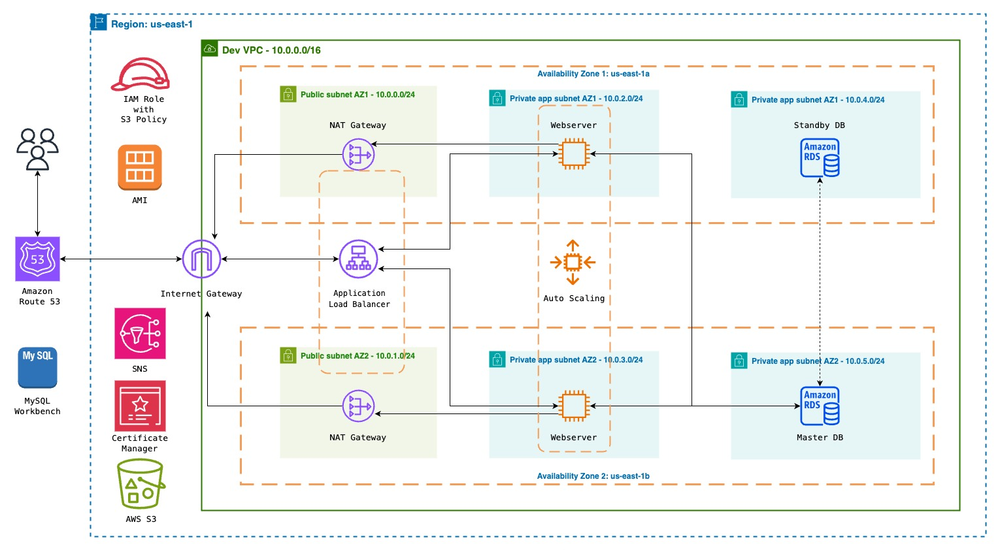

# Car Rental Web Application on AWS with LAMP Stack

## Overview

This project deploys a dynamic Car Rental Web Application on AWS using a LAMP Stack (Linux, Apache, MySQL, PHP). The infrastructure is designed for high availability, fault tolerance, and scalability.

### Architecture Overview

1. **VPC and Subnets:**
   - 3-tier VPC with public and private subnets across 2 availability zones.
   - Public subnets for resources like NAT Gateway, EIC Endpoint, and Application Load Balancer.
   - Private subnets to protect application and database servers.

2. **Internet Gateway:**
   - Allows communication between instances in VPC and the Internet.

3. **Availability Zones:**
   - Multiple AZs for high availability and fault tolerance.

4. **Network Components:**
   - NAT Gateways for private subnet internet access.

5. **AWS Services:**
   - MySQL RDS for the relational database.
   - EC2 Instances for hosting the web application.
   - Application Load Balancer for distributing web traffic.
   - Auto Scaling Group for dynamic EC2 instance management.
   - Route 53 for domain registration and record set.
   - AWS S3 for storing application codes.
   - IAM Role for EC2 permissions.
   - AMI for storing the configured version of the application.
   - SNS for receiving notifications.
   - Certificate Manager for encrypting data in transit.

6. **Tools and Software:**
   - MySQL Workbench for importing SQL data into the RDS database.

## Deployment Scripts

### EC2 Instance Setup:

```bash
#1. Update EC2 instance
sudo yum update -y

#2. Install Apache
sudo yum install -y httpd
sudo systemctl enable httpd
sudo systemctl start httpd

#3. Install PHP 7.4
sudo amazon-linux-extras enable php7.4
# ... (Install additional PHP packages)

#4. Install MySQL 5.7
# ... (Install MySQL and configure)

#5. Download and unzip application from S3
sudo aws s3 sync s3://scombey-rentzone-web-files /var/www/html
cd /var/www/html
sudo unzip rentzone.zip

#6. Move files and set permissions
sudo mv rentzone/* /var/www/html
sudo mv rentzone/.well-known /var/www/html
sudo mv rentzone/.env /var/www/html
sudo mv rentzone/.htaccess /var/www/html
sudo rm -rf rentzone rentzone.zip
sudo chmod -R 777 /var/www/html
sudo chmod -R 777 storage/

#7. Enable mod_rewrite
sudo sed -i '/<Directory "\/var\/www\/html">/,/<\/Directory>/ s/AllowOverride None/AllowOverride All/' /etc/httpd/conf/httpd.conf

#8. Add database credentials
sudo vi .env

#9. Restart server
sudo service httpd restart
```

### Additional Note:

If the environment is set to production, force HTTPS:

```php
if (env('APP_ENV') === 'production') {
    \Illuminate\Support\Facades\URL::forceScheme('https');
}
```
